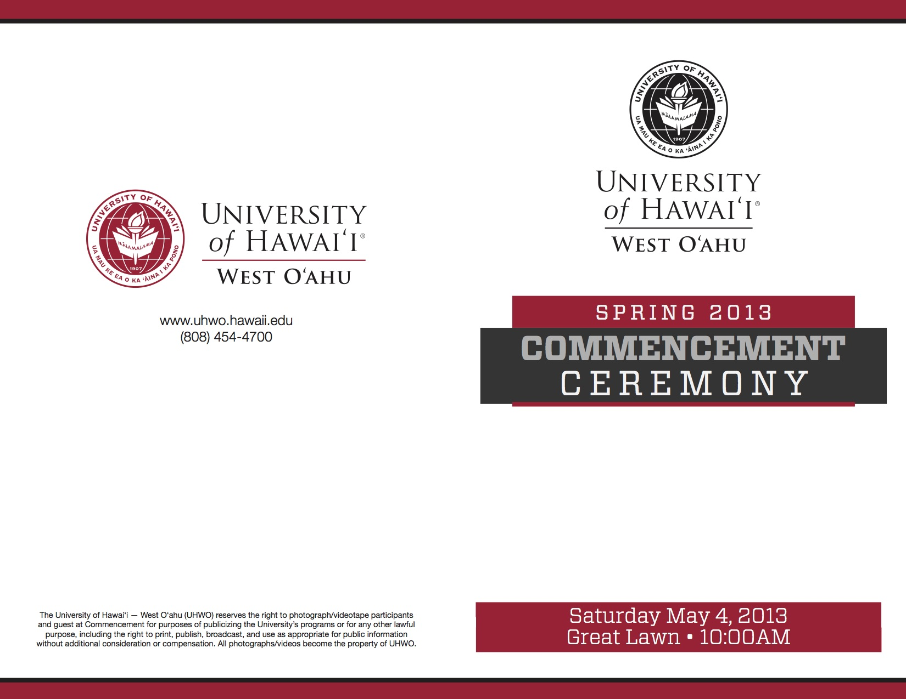
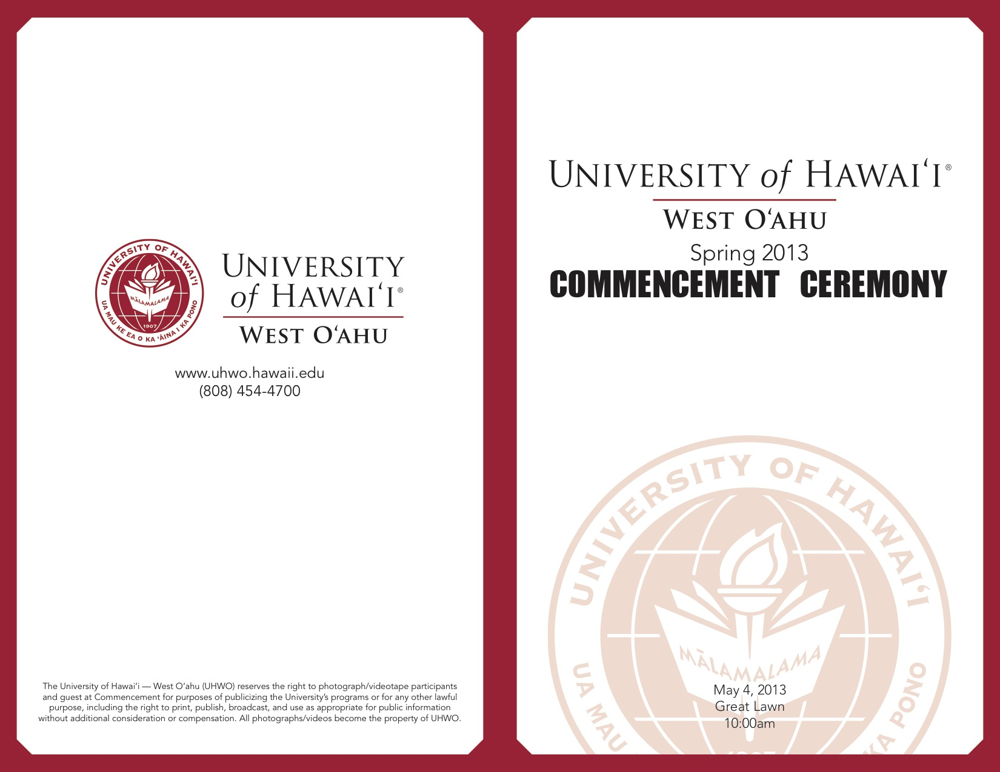
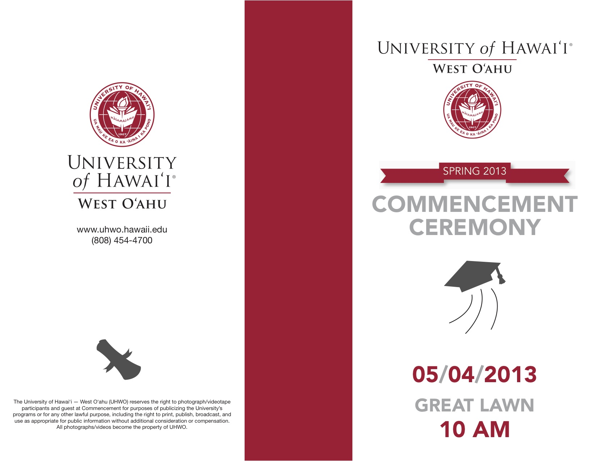
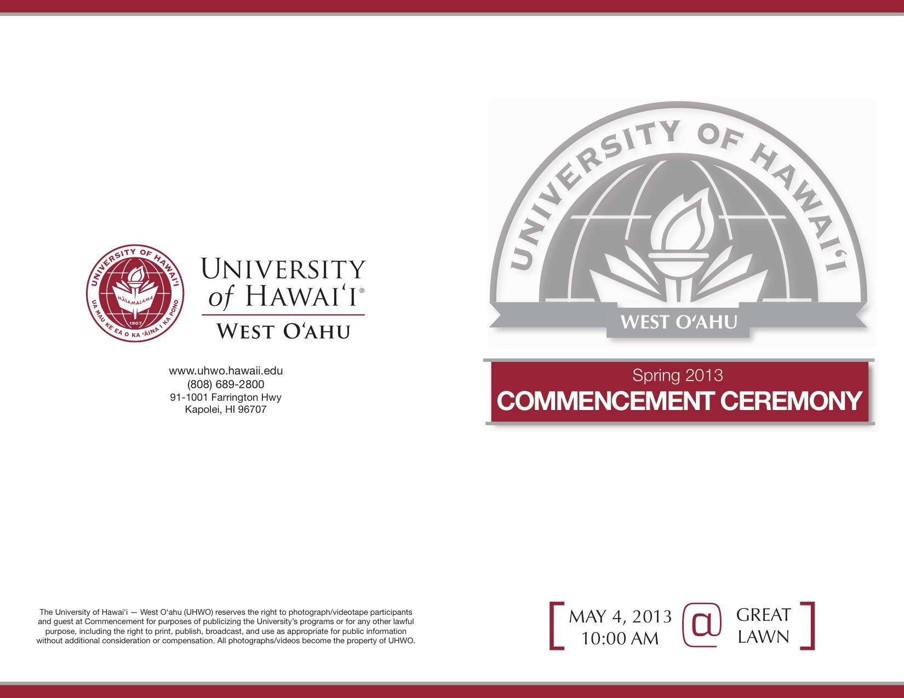
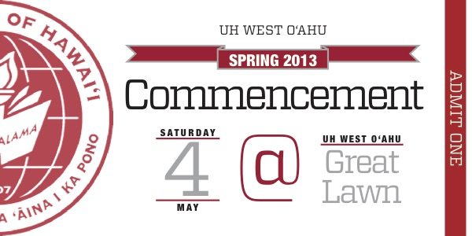
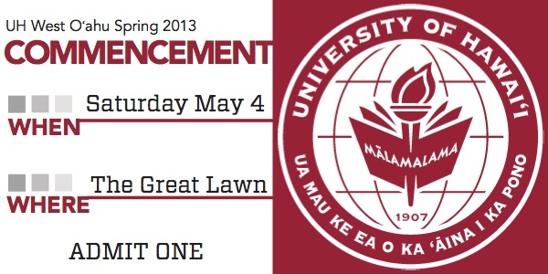
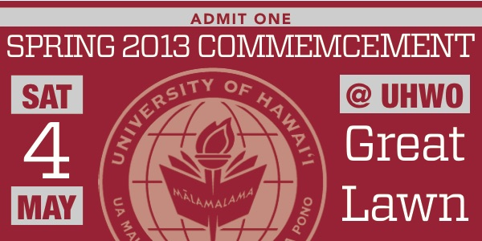
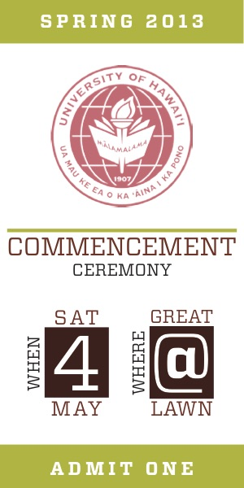
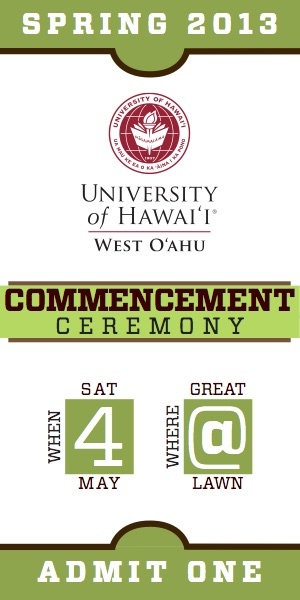

During my last semester at Leeward Community College, I took part in an internship at University of Hawaii West Oahu as a Graphic Design Intern. I worked with the Creative Media team on several projects, the biggest being designing the tickets and program of the Spring 2013 Commencement for their graduating class. I've used Adobe Illustrator and Adobe Indesign to create different templates for both the tickets and program, then had it run through my boss, Sharla Hanaoka, and made any necessary changes needed. 

I was completely responsible for the entirety of the design from start to finish. I did get a second opinion from Sharla on how to make certain aspects of my design better, but for the most part, I was in creative control. I do enjoy having the freedom of deciding exactly how the layout should be for both the tickets and program, but at the same time, I also enjoyed the challenge of having to work around another persons opinion of things and coming to a compromise that would best suit both of our ideas.

This experience has helped heightened my design skills while also working with others in deciding what was the best way to approach the style of the tickets and program. I've created numerous variations of each and with Sharla's help, finalized which one worked best. It was the biggest project that I've worked on while at LCC because I was responsible for something that was going to be seen by hundreds of people for their graduation. 

Below are the different program templates I've designed:*

  
  
  
  
  

  

Below are the different ticket templates I've designed:*

  
  
  

  

  
  
  
  
  
  
  
  

    

  
  

  
<i>*you may 'right-click' + 'open image in new tab' to see full sized version of the image.</i>
