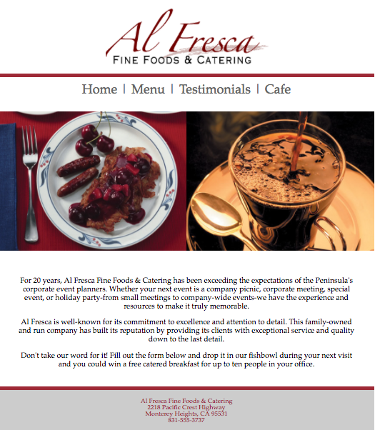
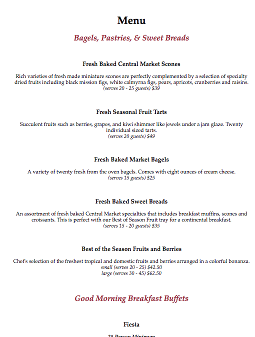
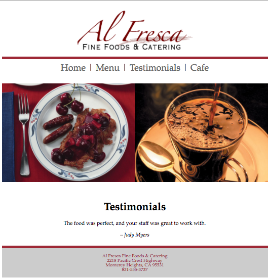

As one of the final project of my Netprep Website Design class, we had to create a simple webpage design on a restaurant using Adobe Dreamweaver. We created a homepage with a simple bio on the restaraunt as shown below:

  

Then we created a Menu page showcasing all the food and beverage items available at the Cafe, along with a short description and price of the menu item. The text was preset, however, we used HTML/CSS to design the overall look and layout of the page:

  

Lastly, we had to created a short testimonial page including one "review" of the restaurant:

  

I've also included an external link to their actual "website" (provided to us by the textbook), however, it no longer exists.

The main focus of this project was to get practice using Adobe Dreamweaver, an Adobe-style Web Design and Development application, to publish our own personal websites online. We seperated this project into smaller portions throughout the semester to help us get a better understanding in the development of a simple web page. Throughout the class, we created a small part of the web page until the last week where everything was put together nicely.

Each student was responsible for their own website demonstrating a certain company/production. We each were put in groups and assigned a specific Cafe, Restaurant, or Store. However, each student was responsible for their own page and choice in CSS design. By the end of the week, there would be numerous web pages on the same Cafe, Restaurant, or Store, but each design differed from one another, showcasing every students individual talent in HTML/CSS.

This project has helped me strengthen my HTML/CSS abilities. My DMED 121 class's primary focus was on developing our coding skills with focus on the design aspect of it. I've learned basic HTML/CSS formatting and incorporated it into Adobe Dreamweaver, also learning how to publish it onto the web. I love working with CSS because of the focus on the artistic aspect of coding, which is where my line of interest in mainly located, so I enjoyed learning the ropes from this project.

The website for the page can be found <a href ="http://www2.hawaii.edu/~cadamos/dmed121/project_05/index.html">here</a>.
