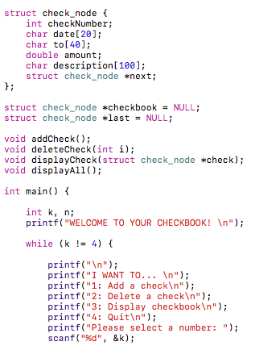
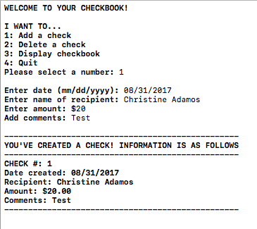

 

For one of the projects of my Program Structure class (ICS 212), we learned how to use a linked list in C. To achieve this goal, we incorporated the use of a checkbook in our code. We had to create a linked list and use some sort of switch prompt to have the user switch through the ability of creating a check, deleting a check, and viewing the checkbook. A name, date, amount, and comment was needed for each check made along with a specific check number that would increment with each check added to the checkbook.

This class was taught online so each student was responsible for their own checkbook. There was no groupwork involved at all for this project, which encouraged students to learn to solve problems on their own. Of course, if students had trouble, the professor and their peers were readily available to answer any questions about troubles they would face while tackling this project, but the code itself had to be done individually. Although I do believe that it is important to do work with each other as a group to learn flexibility, it is also important to not be reliant on other peoples work. This project, along with many other projects in our class has taught us to problem solve and come up with our own unique solutions to the situations presented.

Majority of my C and C++ knowledge was built from not only this project, but this class in general. It is very important, in my opinion, to learn the fundementals of coding, and C/C++ is a good outlet in learning to create code from scratch, whilst also learning different ways to code specific things with certain programs. I've learned to code Lists in Java during my ICS 211 class prior to this one, so it was a challenge to do the same concept over a completely new platform.

Source: <a href="https://github.com/cadamos/cadamos.github.io/blob/master/checkbookCode"><i class="large github icon "></i>code</a>

