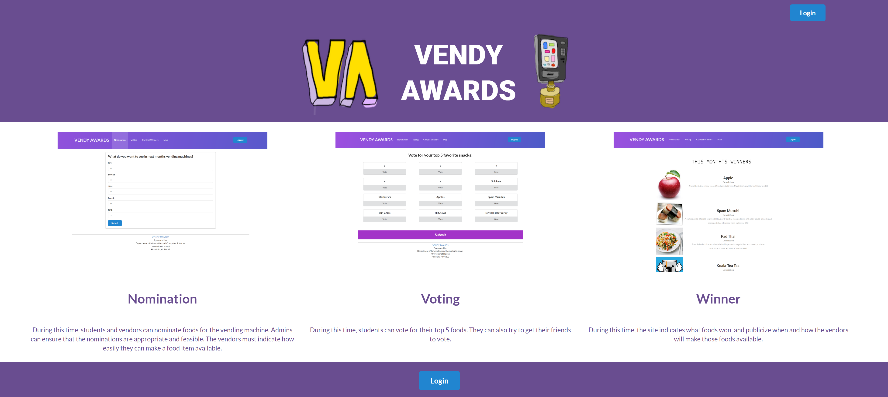

 

  <a href="https://vendyawards.meteorapp.com/">Vendy Awards</a> is a faux app that a couple of my classmates and I had developed for our Software Engineering class. We used meteor to deploy it onto galaxy, making it accessible for those authorized with a UH CAS login account to access and test out the features of our app. We used IntelliJ alongside Meteor to develop the backend and front end of each page of the app and also made it available on android mobile.

<h1>About Vendy Awards</h1>

Vendy Awards is a Meteor application providing UH students with an opportunity to vote on which snacks get placed in campus vending machines. It gives every student an opportunity to voice out what they feel they would like to see and also give vendors an idea of what students like to eat, improving sales of their vending machine items. Every month will consist of three periods and five pages total:

Landing Page: Upon entering the landing page, the user is presented with a short summary of each period of the month along with a screenshot of what they page will look like at the time. They are then required to log in using their UH username and password, then they will be redirected to the page designated for the period of the month that it is currently at. 

* For demonstration purposes, we have created tabs to view each periods page and give an idea of what is expected of each period. In actuality, the user will automatically be redirected to a certain page depending on the time of the month and also be able to access the map page at all times.

Nomination period. During this time, students and vendors can nominate foods for the vending machine. Admins can ensure that the nominations are appropriate and feasible. The vendors must indicate how easily they can make a food item available.

Voting period. During this time, students can vote for their top 5 foods. They can also try to get their friends to vote.

Contest winners. During this time, the site indicates what foods won, and publicize when and where the vendors will make those foods available on the map page.

Map. A google map projection of all the vending machines on campus.

This project helped us develop our skills while also enabling us to work in a group. This aspect of the project was very important because it showed the difficulties that could arise when trying to create one thing using different ideas and concepts. It strengthened our abilities to work with other people as well as encouraging us to be flexible to other people's idea, which is very helpful in the long run when developers must work around client ideas and designs.

For more information, visit the links provided below.

Source: 
  <a href="https://vendyawards.github.io"><i class="github alternate icon"></i>View Home Page</a>
  <a href="https://github.com/vendyawards/vendyawards"><i class="github square icon"></i>View Source Code</a>
